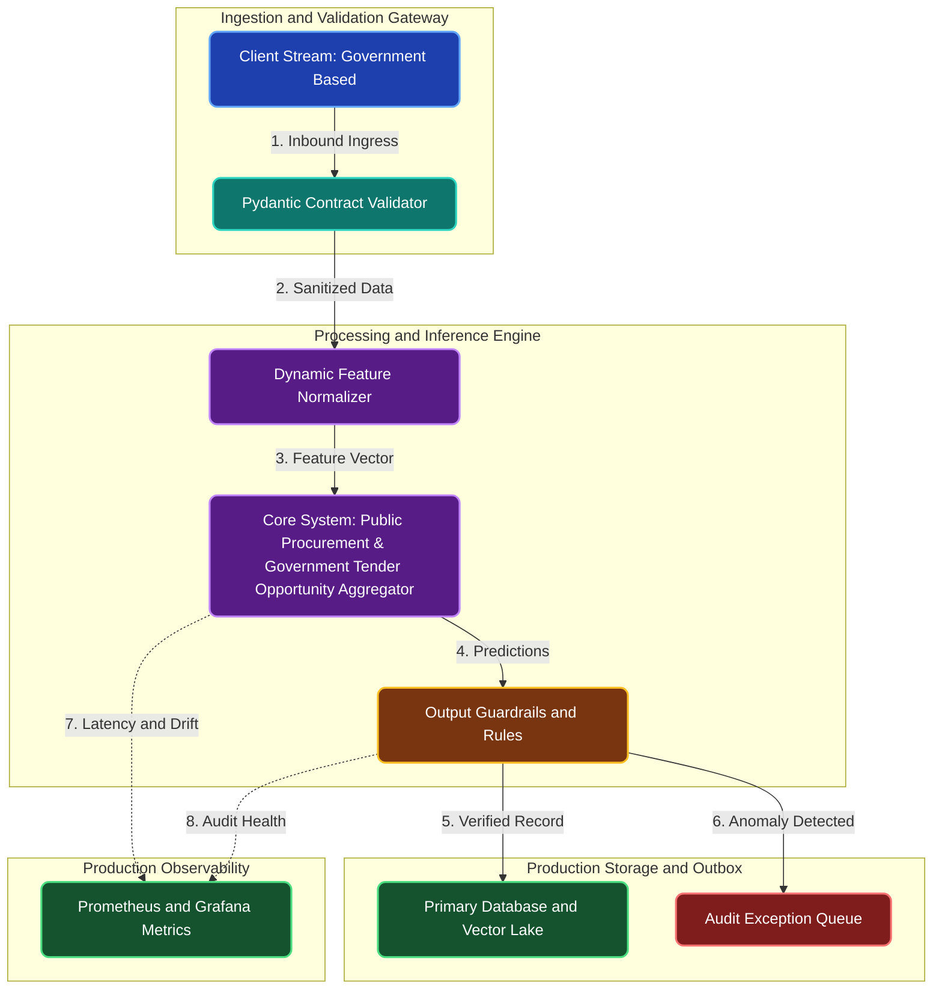

# Public Procurement & Government Tender Opportunity Aggregator

**Engineering Field Notes & System Architecture** • *Domain Focus: Public Sector*

---

## 🏢 1. The Real-World Industry Challenge

Small businesses and defense suppliers miss lucrative government contract bidding opportunities because tender notices are scattered across dozens of municipal, state, and federal portals with convoluted navigation and no automated notification feeds.

---

## 🎯 2. Core Purpose & Architectural Solution

To build an automated web scraper and notification pipeline that systematically crawls public procurement portals, extracts RFP requirements, estimates budgets, and delivers filtered tender alerts.

### 📈 Tangible ROI & Business Impact
Democratizes access to public government contracts, saving small business contractors hundreds of hours of manual portal searching and helping them submit bids well ahead of strict application deadlines.

- **Operational Efficiency**: Eliminates error-prone manual intervention through end-to-end automation.
- **Latency & Reliability**: Guarantees predictable, sub-second execution with defensive validation.
- **Compliance & Auditability**: Enforces strict audit trails, zero-drift precision, and explainable decisions.

---

---

## 🏛️ 3. Production System Architecture & Data Flow

---

## ⚙️ 4. Engineering Specification & Stack Matrix

| Architectural Layer | Production Component & Selection | Free Tier / Open-Source Tooling |
|:---|:---|:---|
| **Core Model Engine** | **Rule-Engine & Deterministic Hashing (Decimal / SHA-256 / Regex AST)** | Open-source weights / Framework native |
| **Training & Fine-Tuning** | **Stateless Validation Rules & Decimal Quantization (Zero Drift)** | **Kaggle GPU (Dual T4)** / Colab / Unsloth |
| **Benchmark Dataset** | **Real-World Government Based Transaction Logs & Audit Datasets (CSV/JSON/MT940)** | Free public datasets (Kaggle, HF, Data.gov) |
| **User Interface (UI)** | **Streamlit Interactive Web Cockpit & REST API** | Streamlit UI (`app.py`) with reactive components |
| **Live UI Hosting** | **Streamlit Community Cloud (Free 24/7) / FastAPI Swagger Docs** | **100% Free Live Web Hosting** |
| **Validation & Test Suite** | **Pytest Unit/Integration Suite + Synthetic Evals** | Automated pre-deployment verification |

---

## 🔗 Source Code & Repository

Explore the complete reproducible implementation, tests, and configuration manifests in the master GitHub repository:
👉 **[View Code on GitHub: `00_python/04_government_public_procurement_scraper`](https://github.com/machhakiran/ai-engineering-master-projects/tree/main/00_python/04_government_public_procurement_scraper)**

*Authored by **[Kiran Macha](https://www.machhakiran.pro/)** — Forward Deployed AI Solutions Architect.*
