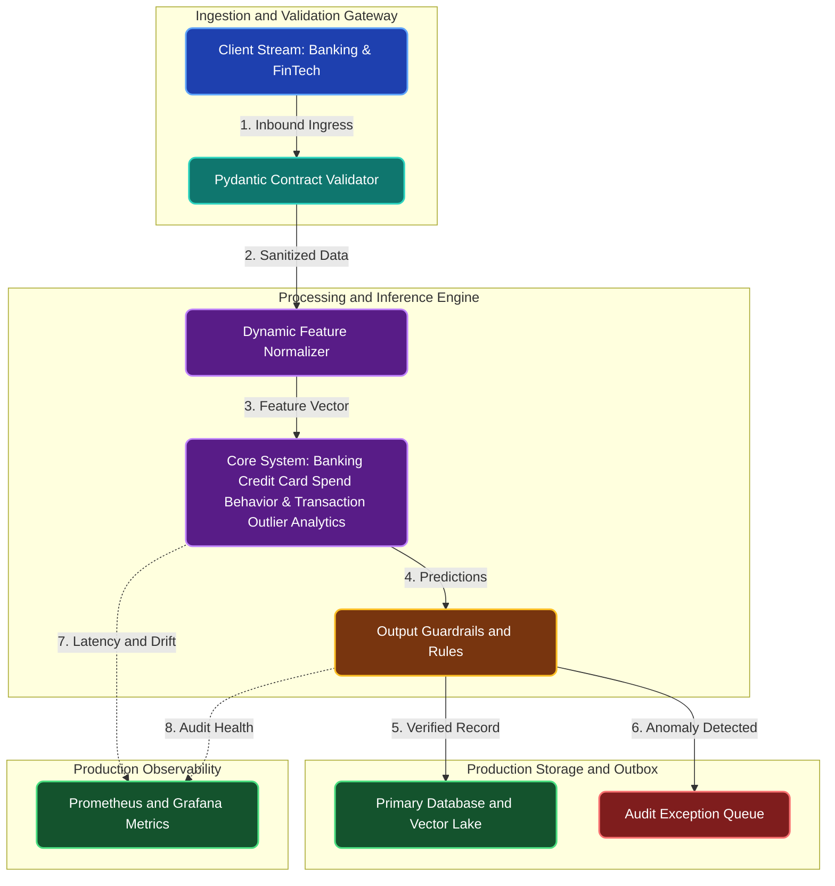

# Banking Credit Card Spend Behavior & Transaction Outlier Analytics

**Engineering Field Notes & System Architecture** • *Domain Focus: FinTech*

---

## 🏢 1. The Real-World Industry Challenge

Banks struggle to understand shifting customer financial health from raw credit card transactions. Traditional monthly aggregate statements fail to capture rapid shifts in spending habits, emerging lifestyle changes, or subtle pre-delinquency signals.

---

## 🎯 2. Core Purpose & Architectural Solution

To perform comprehensive statistical exploratory data analysis (EDA) and analytical SQL window queries across millions of card transactions to compute customer RFM (Recency, Frequency, Monetary) segments and detect transaction velocity anomalies.

### 📈 Tangible ROI & Business Impact
Enables risk officers to spot borrower distress months before loan default, while equipping marketing teams to design tailored cashback incentives that increase customer card spend and loyalty.

- **Operational Efficiency**: Eliminates error-prone manual intervention through end-to-end automation.
- **Latency & Reliability**: Guarantees predictable, sub-second execution with defensive validation.
- **Compliance & Auditability**: Enforces strict audit trails, zero-drift precision, and explainable decisions.

---

---

## 🏛️ 3. Production System Architecture & Data Flow

---

## ⚙️ 4. Engineering Specification & Stack Matrix

| Architectural Layer | Production Component & Selection | Free Tier / Open-Source Tooling |
|:---|:---|:---|
| **Core Model Engine** | **Probabilistic BG/NBD, Gamma-Gamma, Robust Z-Score, Scipy Hypothesis Engines** | Open-source weights / Framework native |
| **Training & Fine-Tuning** | **Columnar SQL Vectorization & In-Memory Analytical Window Aggregations** | **Kaggle GPU (Dual T4)** / Colab / Unsloth |
| **Benchmark Dataset** | **Multi-Million Row Banking & FinTech Historical Analytical Tables (DuckDB / PostgreSQL)** | Free public datasets (Kaggle, HF, Data.gov) |
| **User Interface (UI)** | **Streamlit Interactive Web Cockpit & REST API** | Streamlit UI (`app.py`) with reactive components |
| **Live UI Hosting** | **Streamlit Community Cloud (Interactive Cohort & Latency Heatmaps)** | **100% Free Live Web Hosting** |
| **Validation & Test Suite** | **Pytest Unit/Integration Suite + Synthetic Evals** | Automated pre-deployment verification |

---

## 🔗 Source Code & Repository

Explore the complete reproducible implementation, tests, and configuration manifests in the master GitHub repository:
👉 **[View Code on GitHub: `01_data_science_sql_stats/01_bank_credit_card_spend_analytics`](https://github.com/machhakiran/ai-engineering-master-projects/tree/main/01_data_science_sql_stats/01_bank_credit_card_spend_analytics)**

*Authored by **[Kiran Macha](https://www.machhakiran.pro/)** — Forward Deployed AI Solutions Architect.*
