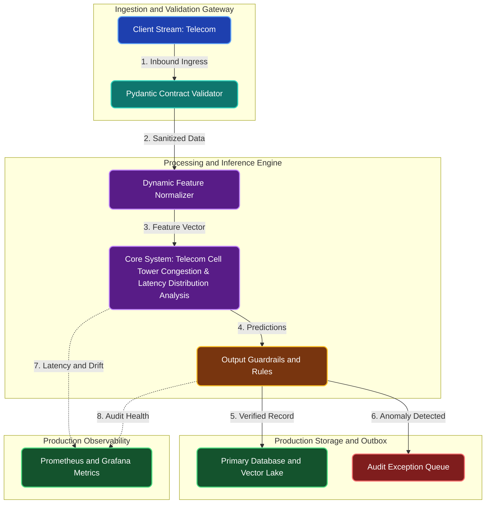

# Telecom Cell Tower Congestion & Latency Distribution Analysis

**Engineering Field Notes & System Architecture** • *Domain Focus: Telecom*

---

## 🏢 1. The Real-World Industry Challenge

Telecom engineering teams often misallocate multi-million dollar 5G fiber infrastructure budgets because they rely on simple average bandwidth metrics that hide extreme peak-hour network congestion and latency spikes.

---

## 🎯 2. Core Purpose & Architectural Solution

To conduct rigorous statistical distributions analysis, empirical CDF estimation, and hypothesis testing (Kolmogorov-Smirnov & ANOVA) on cell tower packet latency telemetry to identify true bottleneck nodes.

### 📈 Tangible ROI & Business Impact
Provides network planners with statistical evidence showing exactly which cell towers suffer from genuine capacity exhaustion versus transient noise, optimizing infrastructure capital expenditure by over 30%.

- **Operational Efficiency**: Eliminates error-prone manual intervention through end-to-end automation.
- **Latency & Reliability**: Guarantees predictable, sub-second execution with defensive validation.
- **Compliance & Auditability**: Enforces strict audit trails, zero-drift precision, and explainable decisions.

---

---

## 🏛️ 3. Production System Architecture & Data Flow

---

## ⚙️ 4. Engineering Specification & Stack Matrix

| Architectural Layer | Production Component & Selection | Free Tier / Open-Source Tooling |
|:---|:---|:---|
| **Core Model Engine** | **Probabilistic BG/NBD, Gamma-Gamma, Robust Z-Score, Scipy Hypothesis Engines** | Open-source weights / Framework native |
| **Training & Fine-Tuning** | **Columnar SQL Vectorization & In-Memory Analytical Window Aggregations** | **Kaggle GPU (Dual T4)** / Colab / Unsloth |
| **Benchmark Dataset** | **Multi-Million Row Telecom Historical Analytical Tables (DuckDB / PostgreSQL)** | Free public datasets (Kaggle, HF, Data.gov) |
| **User Interface (UI)** | **Streamlit Interactive Web Cockpit & REST API** | Streamlit UI (`app.py`) with reactive components |
| **Live UI Hosting** | **Streamlit Community Cloud (Interactive Cohort & Latency Heatmaps)** | **100% Free Live Web Hosting** |
| **Validation & Test Suite** | **Pytest Unit/Integration Suite + Synthetic Evals** | Automated pre-deployment verification |

---

## 🔗 Source Code & Repository

Explore the complete reproducible implementation, tests, and configuration manifests in the master GitHub repository:
👉 **[View Code on GitHub: `01_data_science_sql_stats/02_telecom_network_bandwidth_analysis`](https://github.com/machhakiran/ai-engineering-master-projects/tree/main/01_data_science_sql_stats/02_telecom_network_bandwidth_analysis)**

*Authored by **[Kiran Macha](https://www.machhakiran.pro/)** — Forward Deployed AI Solutions Architect.*
