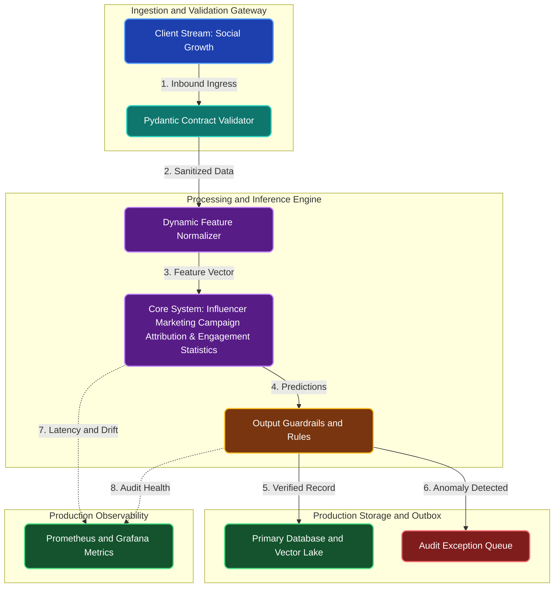

# Influencer Marketing Campaign Attribution & Engagement Statistics

**Engineering Field Notes & System Architecture** • *Domain Focus: Data Science Sql Stats*

---

## 🏢 1. The Real-World Industry Challenge

Consumer brands spend millions sponsoring social media influencers without knowing if sales spikes during campaign windows are caused by the creator's video or by coinciding organic marketplace trends.

---

## 🎯 2. Core Purpose & Architectural Solution

To apply causal inference statistical techniques (Difference-in-Differences and Propensity Score Matching) on social video view metrics and e-commerce conversions to measure true incremental sales attribution.

### 📈 Tangible ROI & Business Impact
Prevents brands from wasting budget on influencers with inflated fake follower counts, identifying creators with genuine conversion power and maximizing sponsorship return on investment.

- **Operational Efficiency**: Eliminates error-prone manual intervention through end-to-end automation.
- **Latency & Reliability**: Guarantees predictable, sub-second execution with defensive validation.
- **Compliance & Auditability**: Enforces strict audit trails, zero-drift precision, and explainable decisions.

---

---

## 🏛️ 3. Production System Architecture & Data Flow

---

## ⚙️ 4. Engineering Specification & Stack Matrix

| Architectural Layer | Production Component & Selection | Free Tier / Open-Source Tooling |
|:---|:---|:---|
| **Core Model Engine** | **Probabilistic BG/NBD, Gamma-Gamma, Robust Z-Score, Scipy Hypothesis Engines** | Open-source weights / Framework native |
| **Training & Fine-Tuning** | **Columnar SQL Vectorization & In-Memory Analytical Window Aggregations** | **Kaggle GPU (Dual T4)** / Colab / Unsloth |
| **Benchmark Dataset** | **Multi-Million Row Social Growth Historical Analytical Tables (DuckDB / PostgreSQL)** | Free public datasets (Kaggle, HF, Data.gov) |
| **User Interface (UI)** | **Streamlit Interactive Web Cockpit & REST API** | Streamlit UI (`app.py`) with reactive components |
| **Live UI Hosting** | **Streamlit Community Cloud (Interactive Cohort & Latency Heatmaps)** | **100% Free Live Web Hosting** |
| **Validation & Test Suite** | **Pytest Unit/Integration Suite + Synthetic Evals** | Automated pre-deployment verification |

---

## 🔗 Source Code & Repository

Explore the complete reproducible implementation, tests, and configuration manifests in the master GitHub repository:
👉 **[View Code on GitHub: `01_data_science_sql_stats/04_social_growth_influencer_campaign_roi`](https://github.com/machhakiran/ai-engineering-master-projects/tree/main/01_data_science_sql_stats/04_social_growth_influencer_campaign_roi)**

*Authored by **[Kiran Macha](https://www.machhakiran.pro/)** — Forward Deployed AI Solutions Architect.*
