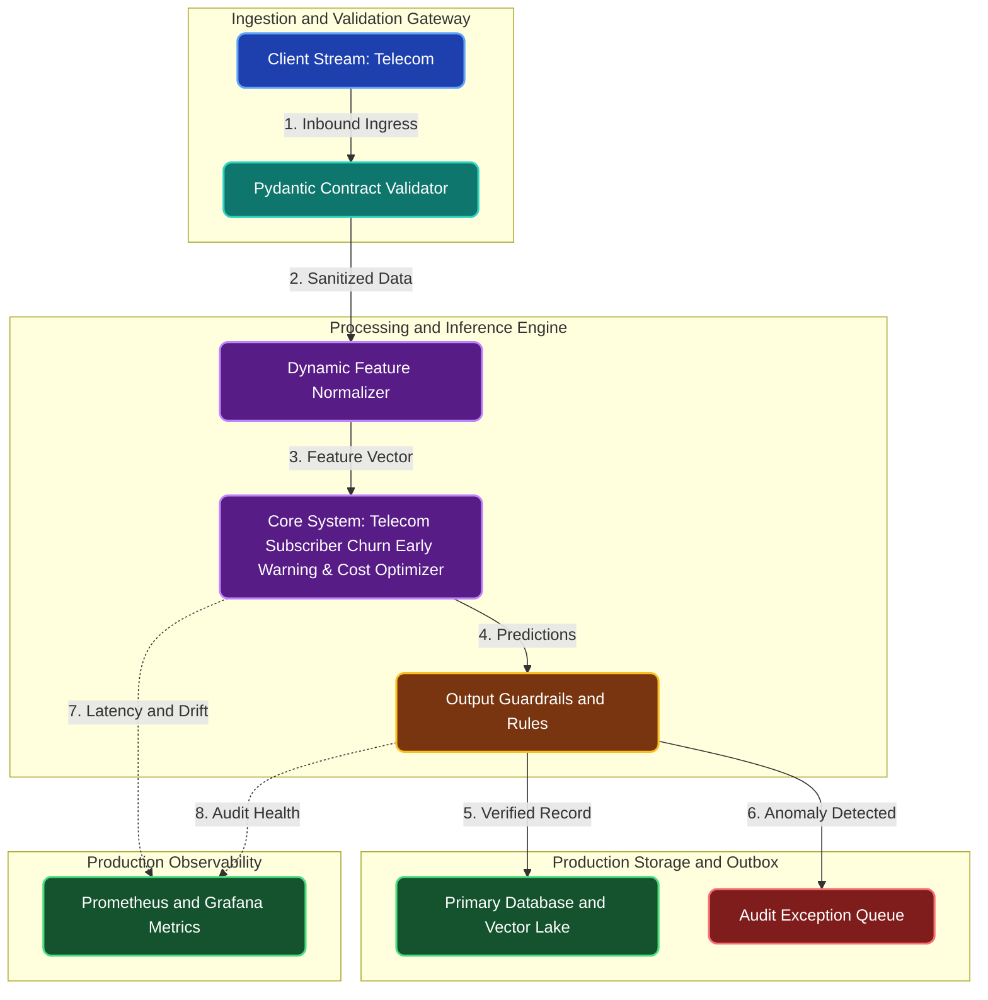

# Telecom Subscriber Churn Early Warning & Cost Optimizer

**Engineering Field Notes & System Architecture** • *Domain Focus: Telecom*

---

## 🏢 1. The Real-World Industry Challenge

Telecom operators lose significant revenue when post-paid mobile subscribers switch to competing carriers. Once a customer calls customer service to cancel, it is usually too late to retain them.

---

## 🎯 2. Core Purpose & Architectural Solution

To develop an early-warning churn classification model that analyzes customer billing patterns, dropped call frequency, and customer service contacts to identify high-risk subscribers 60 days before contract expiration.

### 📈 Tangible ROI & Business Impact
Empowers marketing and retention teams to offer targeted, cost-effective incentives (e.g., free data booster or plan discount) exclusively to subscribers at genuine risk of leaving, cutting customer attrition rates by 25%.

- **Operational Efficiency**: Eliminates error-prone manual intervention through end-to-end automation.
- **Latency & Reliability**: Guarantees predictable, sub-second execution with defensive validation.
- **Compliance & Auditability**: Enforces strict audit trails, zero-drift precision, and explainable decisions.

---

---

## 🏛️ 3. Production System Architecture & Data Flow

---

## ⚙️ 4. Engineering Specification & Stack Matrix

| Architectural Layer | Production Component & Selection | Free Tier / Open-Source Tooling |
|:---|:---|:---|
| **Core Model Engine** | **LightGBM / XGBoost / CatBoost with Optuna Bayesian Search & SHAP Governance** | Open-source weights / Framework native |
| **Training & Fine-Tuning** | **Cost-Sensitive Training, PR-AUC Threshold Tuning & 5-Fold Stratified CV** | **Kaggle GPU (Dual T4)** / Colab / Unsloth |
| **Benchmark Dataset** | **Supervised Telecom Historical Records with Class-Imbalanced Labels** | Free public datasets (Kaggle, HF, Data.gov) |
| **User Interface (UI)** | **Streamlit Interactive Web Cockpit & REST API** | Streamlit UI (`app.py`) with reactive components |
| **Live UI Hosting** | **Streamlit Community Cloud + Hugging Face Spaces (CPU Basic 16GB)** | **100% Free Live Web Hosting** |
| **Validation & Test Suite** | **Pytest Unit/Integration Suite + Synthetic Evals** | Automated pre-deployment verification |

---

## 🔗 Source Code & Repository

Explore the complete reproducible implementation, tests, and configuration manifests in the master GitHub repository:
👉 **[View Code on GitHub: `02_machine_learning/02_telecom_subscriber_churn_predictor`](https://github.com/machhakiran/ai-engineering-master-projects/tree/main/02_machine_learning/02_telecom_subscriber_churn_predictor)**

*Authored by **[Kiran Macha](https://www.machhakiran.pro/)** — Forward Deployed AI Solutions Architect.*
