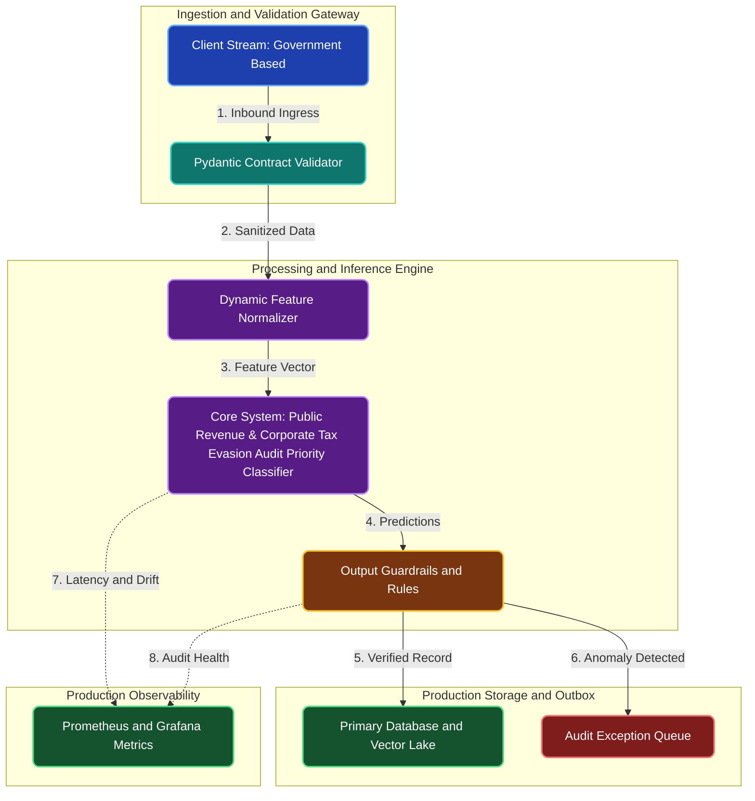

# Public Revenue & Corporate Tax Evasion Audit Priority Classifier

**Engineering Field Notes & System Architecture** • *Domain Focus: Public Sector*

---

## 🏢 1. The Real-World Industry Challenge

Government revenue authorities receive millions of corporate and individual tax filings each year, but only have enough human auditors to manually examine less than 1% of submissions.

---

## 🎯 2. Core Purpose & Architectural Solution

To develop a machine learning audit prioritization classifier that evaluates accounting anomalies, deduction ratios, and Benford's Law distribution compliance to rank tax returns by non-compliance risk.

### 📈 Tangible ROI & Business Impact
Directs audit investigations toward returns with high evasion probability, recovering millions in uncollected public tax revenue while reducing unnecessary audit disruption for honest tax-paying citizens.

- **Operational Efficiency**: Eliminates error-prone manual intervention through end-to-end automation.
- **Latency & Reliability**: Guarantees predictable, sub-second execution with defensive validation.
- **Compliance & Auditability**: Enforces strict audit trails, zero-drift precision, and explainable decisions.

---

---

## 🏛️ 3. Production System Architecture & Data Flow

---

## ⚙️ 4. Engineering Specification & Stack Matrix

| Architectural Layer | Production Component & Selection | Free Tier / Open-Source Tooling |
|:---|:---|:---|
| **Core Model Engine** | **LightGBM / XGBoost / CatBoost with Optuna Bayesian Search & SHAP Governance** | Open-source weights / Framework native |
| **Training & Fine-Tuning** | **Cost-Sensitive Training, PR-AUC Threshold Tuning & 5-Fold Stratified CV** | **Kaggle GPU (Dual T4)** / Colab / Unsloth |
| **Benchmark Dataset** | **Supervised Government Based Historical Records with Class-Imbalanced Labels** | Free public datasets (Kaggle, HF, Data.gov) |
| **User Interface (UI)** | **Streamlit Interactive Web Cockpit & REST API** | Streamlit UI (`app.py`) with reactive components |
| **Live UI Hosting** | **Streamlit Community Cloud + Hugging Face Spaces (CPU Basic 16GB)** | **100% Free Live Web Hosting** |
| **Validation & Test Suite** | **Pytest Unit/Integration Suite + Synthetic Evals** | Automated pre-deployment verification |

---

## 🔗 Source Code & Repository

Explore the complete reproducible implementation, tests, and configuration manifests in the master GitHub repository:
👉 **[View Code on GitHub: `02_machine_learning/04_government_tax_evasion_anomaly_detector`](https://github.com/machhakiran/ai-engineering-master-projects/tree/main/02_machine_learning/04_government_tax_evasion_anomaly_detector)**

*Authored by **[Kiran Macha](https://www.machhakiran.pro/)** — Forward Deployed AI Solutions Architect.*
