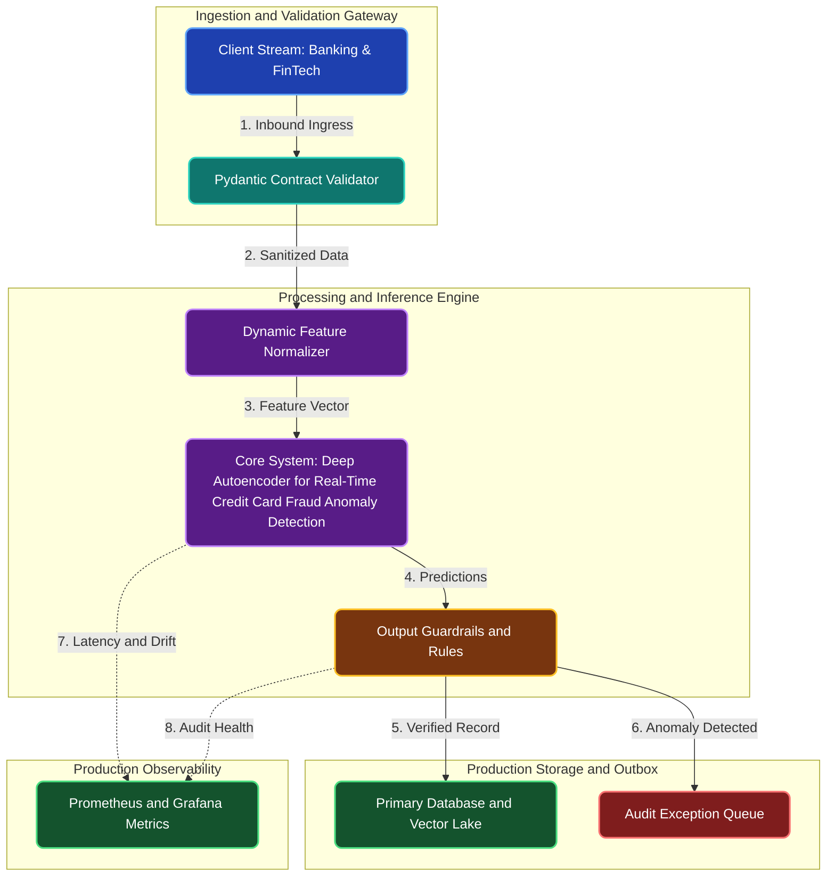

# Deep Autoencoder for Real-Time Credit Card Fraud Anomaly Detection

**Engineering Field Notes & System Architecture** • *Domain Focus: FinTech*

---

## 🏢 1. The Real-World Industry Challenge

Sophisticated financial fraudsters constantly invent novel transaction laundering methods that evade static threshold rules and supervised classifiers that only recognize previously documented fraud patterns.

---

## 🎯 2. Core Purpose & Architectural Solution

To construct an unsupervised deep autoencoder neural network in PyTorch that reconstructs normal transaction behavior and flags unseen fraud patterns based on latent space reconstruction error spikes.

### 📈 Tangible ROI & Business Impact
Detects novel zero-day credit card fraud schemes that traditional rule engines miss, protecting bank cardholders from unauthorized account takeovers and chargeback disputes.

- **Operational Efficiency**: Eliminates error-prone manual intervention through end-to-end automation.
- **Latency & Reliability**: Guarantees predictable, sub-second execution with defensive validation.
- **Compliance & Auditability**: Enforces strict audit trails, zero-drift precision, and explainable decisions.

---

---

## 🏛️ 3. Production System Architecture & Data Flow

---

## ⚙️ 4. Engineering Specification & Stack Matrix

| Architectural Layer | Production Component & Selection | Free Tier / Open-Source Tooling |
|:---|:---|:---|
| **Core Model Engine** | **PyTorch Deep Autoencoders / Stacked LSTMs / Vision Transformers (ViT)** | Open-source weights / Framework native |
| **Training & Fine-Tuning** | **Kaggle GPU (Dual T4 32GB VRAM): AdamW, Cosine Annealing, AMP (FP16)** | **Kaggle GPU (Dual T4)** / Colab / Unsloth |
| **Benchmark Dataset** | **Unsupervised High-Frequency Banking & FinTech Audio/Vision/Sensor Sequences** | Free public datasets (Kaggle, HF, Data.gov) |
| **User Interface (UI)** | **Streamlit Interactive Web Cockpit & REST API** | Streamlit UI (`app.py`) with reactive components |
| **Live UI Hosting** | **Hugging Face Spaces (Gradio / Streamlit) & Kaggle Interactive Notebook** | **100% Free Live Web Hosting** |
| **Validation & Test Suite** | **Pytest Unit/Integration Suite + Synthetic Evals** | Automated pre-deployment verification |

---

## 🔗 Source Code & Repository

Explore the complete reproducible implementation, tests, and configuration manifests in the master GitHub repository:
👉 **[View Code on GitHub: `03_deep_learning_pytorch/01_bank_fraud_detection_autoencoders`](https://github.com/machhakiran/ai-engineering-master-projects/tree/main/03_deep_learning_pytorch/01_bank_fraud_detection_autoencoders)**

*Authored by **[Kiran Macha](https://www.machhakiran.pro/)** — Forward Deployed AI Solutions Architect.*
