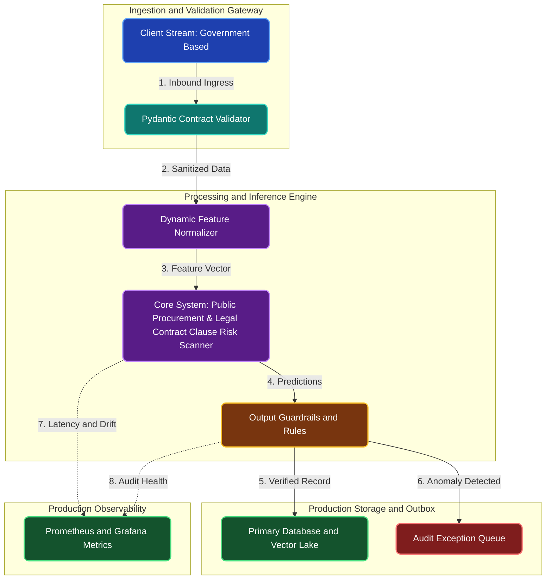

# Public Procurement & Legal Contract Clause Risk Scanner

**Engineering Field Notes & System Architecture** • *Domain Focus: Public Sector*

---

## 🏢 1. The Real-World Industry Challenge

Government procurement legal teams spend weeks reviewing multi-hundred page vendor bids to verify whether contracts comply with mandatory federal indemnification, labor, and cybersecurity compliance statutes.

---

## 🎯 2. Core Purpose & Architectural Solution

To deploy a fine-tuned LegalBERT token classification model that automatically parses lengthy contract PDFs and extracts high-risk clauses, uncapped liability terms, and missing regulatory requirements.

### 📈 Tangible ROI & Business Impact
Reduces legal contract review turnaround times from weeks to minutes, flags non-compliant vendor proposals before contract execution, and protects taxpayers from costly legal disputes.

- **Operational Efficiency**: Eliminates error-prone manual intervention through end-to-end automation.
- **Latency & Reliability**: Guarantees predictable, sub-second execution with defensive validation.
- **Compliance & Auditability**: Enforces strict audit trails, zero-drift precision, and explainable decisions.

---

---

## 🏛️ 3. Production System Architecture & Data Flow

---

## ⚙️ 4. Engineering Specification & Stack Matrix

| Architectural Layer | Production Component & Selection | Free Tier / Open-Source Tooling |
|:---|:---|:---|
| **Core Model Engine** | **Fine-Tuned Hugging Face Transformers (Pegasus, BART, RoBERTa, DistilBERT)** | Open-source weights / Framework native |
| **Training & Fine-Tuning** | **Kaggle / Colab GPU: HuggingFace Trainer with LoRA / PEFT and FP16** | **Kaggle GPU (Dual T4)** / Colab / Unsloth |
| **Benchmark Dataset** | **Domain Government Based Text Transcripts, Support Logs & Legal Contracts (CUAD)** | Free public datasets (Kaggle, HF, Data.gov) |
| **User Interface (UI)** | **Streamlit Interactive Web Cockpit & REST API** | Streamlit UI (`app.py`) with reactive components |
| **Live UI Hosting** | **Hugging Face Spaces (2 vCPU, 16GB RAM) + Streamlit Community Cloud** | **100% Free Live Web Hosting** |
| **Validation & Test Suite** | **Pytest Unit/Integration Suite + Synthetic Evals** | Automated pre-deployment verification |

---

## 🔗 Source Code & Repository

Explore the complete reproducible implementation, tests, and configuration manifests in the master GitHub repository:
👉 **[View Code on GitHub: `04_nlp/04_government_contract_compliance_ner`](https://github.com/machhakiran/ai-engineering-master-projects/tree/main/04_nlp/04_government_contract_compliance_ner)**

*Authored by **[Kiran Macha](https://www.machhakiran.pro/)** — Forward Deployed AI Solutions Architect.*
