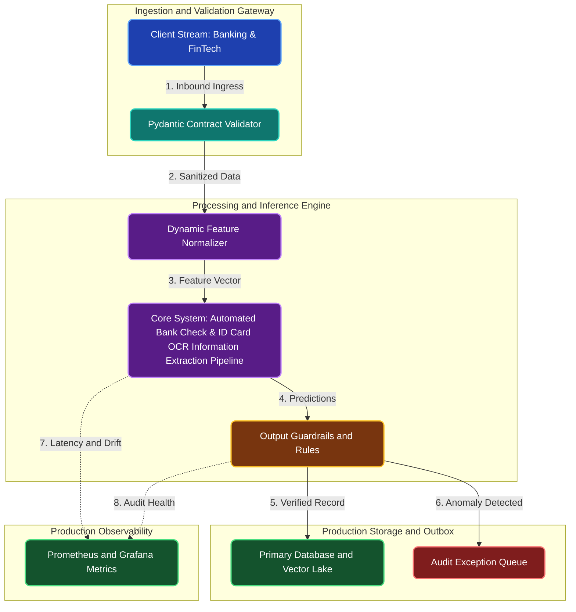

# Automated Bank Check & ID Card OCR Information Extraction Pipeline

**Engineering Field Notes & System Architecture** • *Domain Focus: FinTech*

---

## 🏢 1. The Real-World Industry Challenge

Banking back-offices process thousands of paper checks and customer identity cards daily. Manual data entry of bank account numbers and passport details is slow, costly, and error-prone.

---

## 🎯 2. Core Purpose & Architectural Solution

To build an end-to-end computer vision pipeline using PaddleOCR and OpenCV that rectifies document angle distortion, locates check MICR lines and ID card fields, and extracts verified digital text.

### 📈 Tangible ROI & Business Impact
Enables instantaneous mobile check deposit and automated digital customer onboarding (e-KYC), saving millions in manual data entry processing costs.

- **Operational Efficiency**: Eliminates error-prone manual intervention through end-to-end automation.
- **Latency & Reliability**: Guarantees predictable, sub-second execution with defensive validation.
- **Compliance & Auditability**: Enforces strict audit trails, zero-drift precision, and explainable decisions.

---

---

## 🏛️ 3. Production System Architecture & Data Flow

---

## ⚙️ 4. Engineering Specification & Stack Matrix

| Architectural Layer | Production Component & Selection | Free Tier / Open-Source Tooling |
|:---|:---|:---|
| **Core Model Engine** | **Ultralytics YOLOv8 / YOLOv11 & PaddleOCR (DBNet + CRNN) with TensorRT** | Open-source weights / Framework native |
| **Training & Fine-Tuning** | **Kaggle GPU (30h/wk Free): Mosaic Augmentation, Transfer Learning** | **Kaggle GPU (Dual T4)** / Colab / Unsloth |
| **Benchmark Dataset** | **Annotated Banking & FinTech Inspection Images, Scans & Video Streams (COCO format)** | Free public datasets (Kaggle, HF, Data.gov) |
| **User Interface (UI)** | **Streamlit Interactive Web Cockpit & REST API** | Streamlit UI (`app.py`) with reactive components |
| **Live UI Hosting** | **Hugging Face Spaces (Webcam / Image Upload GUI) + Streamlit Cloud** | **100% Free Live Web Hosting** |
| **Validation & Test Suite** | **Pytest Unit/Integration Suite + Synthetic Evals** | Automated pre-deployment verification |

---

## 🔗 Source Code & Repository

Explore the complete reproducible implementation, tests, and configuration manifests in the master GitHub repository:
👉 **[View Code on GitHub: `05_computer_vision/01_bank_check_id_card_ocr`](https://github.com/machhakiran/ai-engineering-master-projects/tree/main/05_computer_vision/01_bank_check_id_card_ocr)**

*Authored by **[Kiran Macha](https://www.machhakiran.pro/)** — Forward Deployed AI Solutions Architect.*
