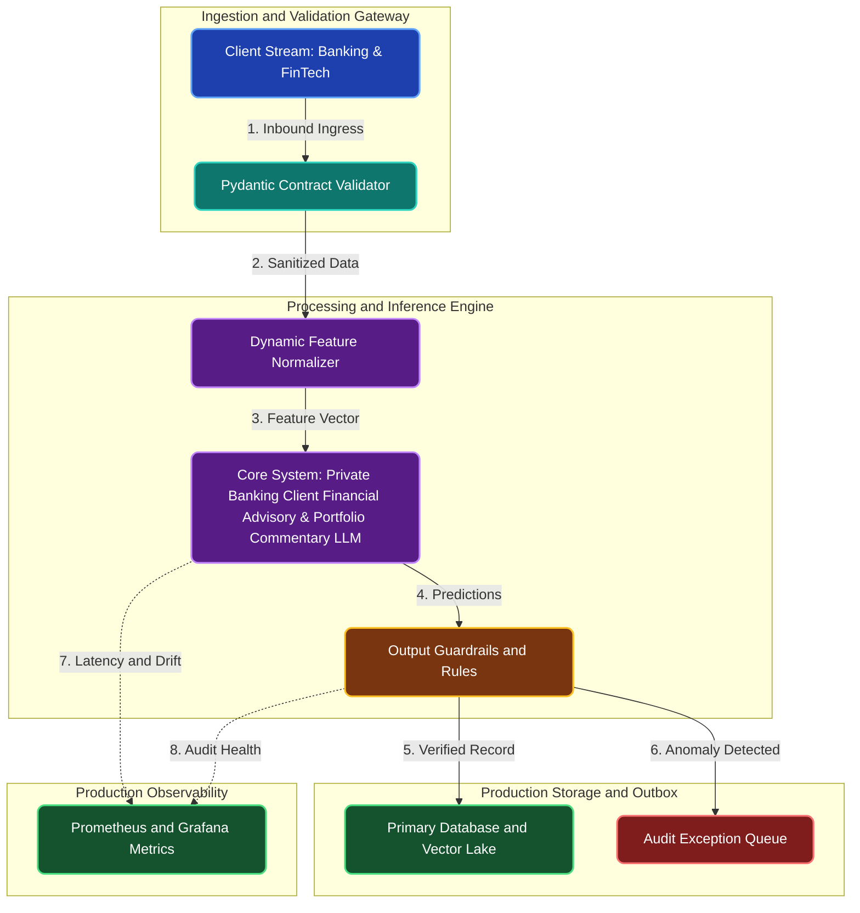

# Private Banking Client Financial Advisory & Portfolio Commentary LLM

**Engineering Field Notes & System Architecture** • *Domain Focus: FinTech*

---

## 🏢 1. The Real-World Industry Challenge

Private wealth advisors manage portfolios for hundreds of affluent clients. Drafting bespoke quarterly market performance letters and rebalancing commentaries for each client requires hours of manual financial writing.

---

## 🎯 2. Core Purpose & Architectural Solution

To fine-tune an open-source LLM (Llama 3.3 / Qwen 2.5) using Unsloth QLoRA on financial research to generate personalized, compliance-checked client portfolio reviews and macroeconomic market summaries.

### 📈 Tangible ROI & Business Impact
Enables financial advisors to deliver high-touch personalized communications to 10x more clients in minutes, ensuring all commentary strictly complies with financial regulatory disclosure rules.

- **Operational Efficiency**: Eliminates error-prone manual intervention through end-to-end automation.
- **Latency & Reliability**: Guarantees predictable, sub-second execution with defensive validation.
- **Compliance & Auditability**: Enforces strict audit trails, zero-drift precision, and explainable decisions.

---

---

## 🏛️ 3. Production System Architecture & Data Flow

---

## ⚙️ 4. Engineering Specification & Stack Matrix

| Architectural Layer | Production Component & Selection | Free Tier / Open-Source Tooling |
|:---|:---|:---|
| **Core Model Engine** | **Llama 3.3 8B / Qwen 2.5 7B / Mistral 7B (Exported to 4-bit GGUF)** | Open-source weights / Framework native |
| **Training & Fine-Tuning** | **Kaggle Dual T4: Unsloth QLoRA 4-bit SFTTrainer (35 mins, <14GB VRAM)** | **Kaggle GPU (Dual T4)** / Colab / Unsloth |
| **Benchmark Dataset** | **Curated Banking & FinTech Multi-Turn Instruction-Response Pairs (JSONL / Parquet)** | Free public datasets (Kaggle, HF, Data.gov) |
| **User Interface (UI)** | **Streamlit Interactive Web Cockpit & REST API** | Streamlit UI (`app.py`) with reactive components |
| **Live UI Hosting** | **Hugging Face Spaces (CPU 4-bit GGUF via llama-cpp) + Groq Free API Fallback** | **100% Free Live Web Hosting** |
| **Validation & Test Suite** | **Pytest Unit/Integration Suite + Synthetic Evals** | Automated pre-deployment verification |

---

## 🔗 Source Code & Repository

Explore the complete reproducible implementation, tests, and configuration manifests in the master GitHub repository:
👉 **[View Code on GitHub: `06_llm_generative_ai/01_bank_wealth_management_advisor`](https://github.com/machhakiran/ai-engineering-master-projects/tree/main/06_llm_generative_ai/01_bank_wealth_management_advisor)**

*Authored by **[Kiran Macha](https://www.machhakiran.pro/)** — Forward Deployed AI Solutions Architect.*
