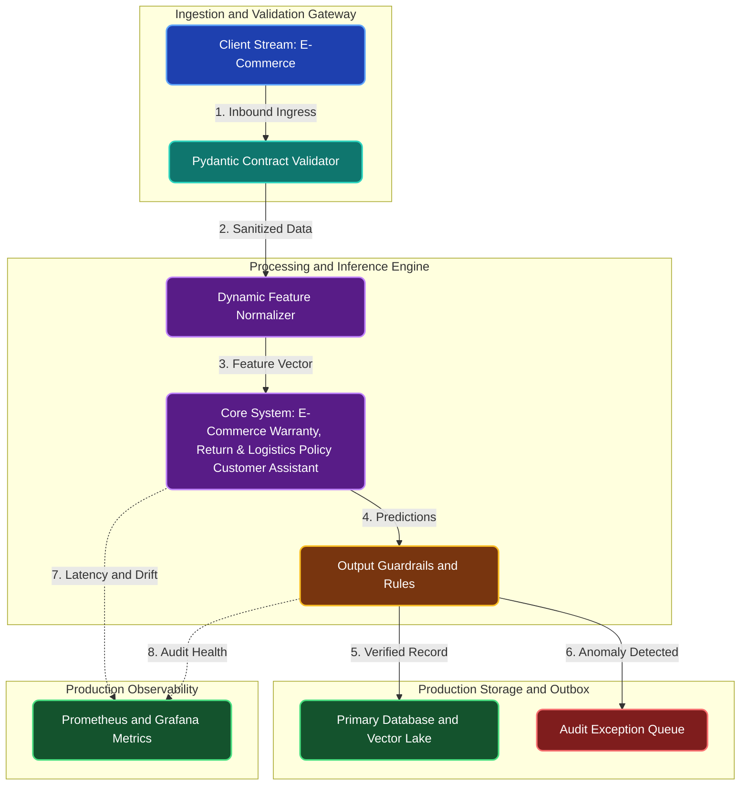

# E-Commerce Warranty, Return & Logistics Policy Customer Assistant

**Engineering Field Notes & System Architecture** • *Domain Focus: E-Commerce*

---

## 🏢 1. The Real-World Industry Challenge

Multi-brand e-commerce marketplaces host thousands of third-party sellers, each with distinct return windows, warranty coverage, and hazardous shipping rules. Customer support reps spend extensive time searching merchant policies.

---

## 🎯 2. Core Purpose & Architectural Solution

To build an in-memory vector RAG system that instantly answers customer return and warranty questions with exact merchant policy citations.

### 📈 Tangible ROI & Business Impact
Provides instant, accurate policy answers to shoppers 24/7, reducing customer support ticket escalation by 45% and preventing seller dispute chargebacks.

- **Operational Efficiency**: Eliminates error-prone manual intervention through end-to-end automation.
- **Latency & Reliability**: Guarantees predictable, sub-second execution with defensive validation.
- **Compliance & Auditability**: Enforces strict audit trails, zero-drift precision, and explainable decisions.

---

---

## 🏛️ 3. Production System Architecture & Data Flow

---

## ⚙️ 4. Engineering Specification & Stack Matrix

| Architectural Layer | Production Component & Selection | Free Tier / Open-Source Tooling |
|:---|:---|:---|
| **Core Model Engine** | **Hybrid Search (Dense Qdrant Vectors + BM25) + Cohere Rerank v3** | Open-source weights / Framework native |
| **Training & Fine-Tuning** | **Zero-Shot Embedding Ingestion with LlamaParse & FastEmbed / BGE-Large** | **Kaggle GPU (Dual T4)** / Colab / Unsloth |
| **Benchmark Dataset** | **Unstructured E-Commerce Compliance Manuals, Policy PDFs & Regulatory Statutes** | Free public datasets (Kaggle, HF, Data.gov) |
| **User Interface (UI)** | **Streamlit Interactive Web Cockpit & REST API** | Streamlit UI (`app.py`) with reactive components |
| **Live UI Hosting** | **Streamlit Community Cloud + Qdrant Cloud Free 1GB Cluster (No Credit Card)** | **100% Free Live Web Hosting** |
| **Validation & Test Suite** | **Pytest Unit/Integration Suite + Synthetic Evals** | Automated pre-deployment verification |

---

## 🔗 Source Code & Repository

Explore the complete reproducible implementation, tests, and configuration manifests in the master GitHub repository:
👉 **[View Code on GitHub: `07_rag_knowledge_systems/03_ecommerce_warranty_return_policy_rag`](https://github.com/machhakiran/ai-engineering-master-projects/tree/main/07_rag_knowledge_systems/03_ecommerce_warranty_return_policy_rag)**

*Authored by **[Kiran Macha](https://www.machhakiran.pro/)** — Forward Deployed AI Solutions Architect.*
