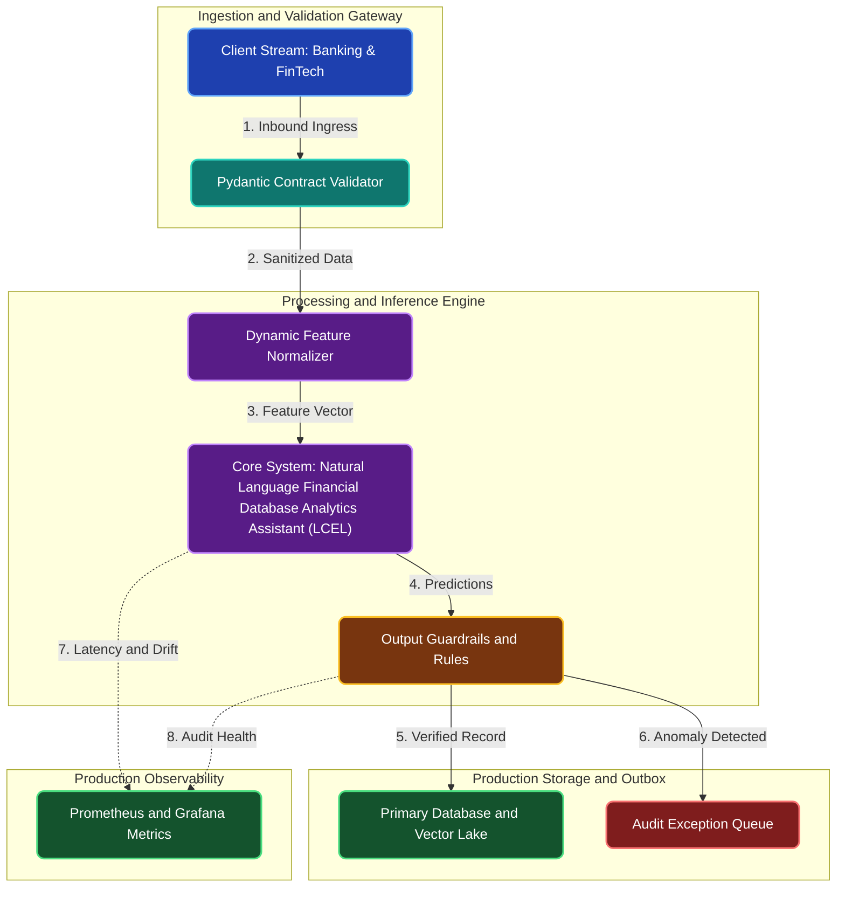

# Natural Language Financial Database Analytics Assistant (LCEL)

**Engineering Field Notes & System Architecture** • *Domain Focus: FinTech*

---

## 🏢 1. The Real-World Industry Challenge

Financial branch managers and fraud investigators need immediate answers from SQL databases (e.g. 'Show accounts with wire transfers >$50k in the last 24h'), but waiting for data analyst teams to write custom queries takes days.

---

## 🎯 2. Core Purpose & Architectural Solution

To construct a LangChain Expression Language (LCEL) copilot that translates plain English financial questions into validated, read-only SQL queries with syntax self-correction.

### 📈 Tangible ROI & Business Impact
Empowers non-technical banking staff to explore enterprise databases directly in seconds, eliminating data team reporting bottlenecks while maintaining strict security sandboxing.

- **Operational Efficiency**: Eliminates error-prone manual intervention through end-to-end automation.
- **Latency & Reliability**: Guarantees predictable, sub-second execution with defensive validation.
- **Compliance & Auditability**: Enforces strict audit trails, zero-drift precision, and explainable decisions.

---

---

## 🏛️ 3. Production System Architecture & Data Flow

---

## ⚙️ 4. Engineering Specification & Stack Matrix

| Architectural Layer | Production Component & Selection | Free Tier / Open-Source Tooling |
|:---|:---|:---|
| **Core Model Engine** | **LangChain Expression Language (LCEL) + Groq Llama 3.3 / Google Gemini 1.5 Flash** | Open-source weights / Framework native |
| **Training & Fine-Tuning** | **Few-Shot Dynamic Prompt Optimization & Pydantic Schema Enforcement** | **Kaggle GPU (Dual T4)** / Colab / Unsloth |
| **Benchmark Dataset** | **Banking & FinTech Operational Schemas, Dynamic Tools & Customer Context Memory** | Free public datasets (Kaggle, HF, Data.gov) |
| **User Interface (UI)** | **Streamlit Interactive Web Cockpit & REST API** | Streamlit UI (`app.py`) with reactive components |
| **Live UI Hosting** | **Streamlit Community Cloud (Chatbot Interface) + LangSmith Free Tracing** | **100% Free Live Web Hosting** |
| **Validation & Test Suite** | **Pytest Unit/Integration Suite + Synthetic Evals** | Automated pre-deployment verification |

---

## 🔗 Source Code & Repository

Explore the complete reproducible implementation, tests, and configuration manifests in the master GitHub repository:
👉 **[View Code on GitHub: `08_langchain/01_bank_natural_language_sql_copilot`](https://github.com/machhakiran/ai-engineering-master-projects/tree/main/08_langchain/01_bank_natural_language_sql_copilot)**

*Authored by **[Kiran Macha](https://www.machhakiran.pro/)** — Forward Deployed AI Solutions Architect.*
