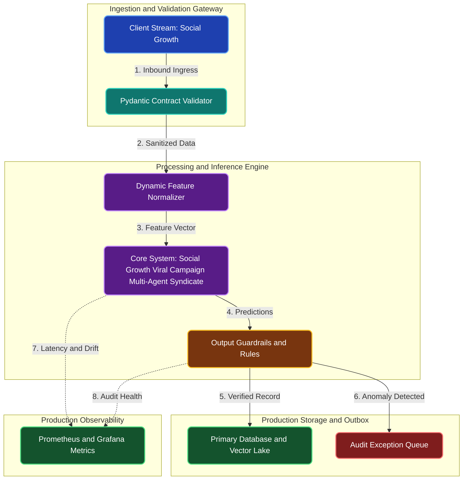

# Social Growth Viral Campaign Multi-Agent Syndicate

**Engineering Field Notes & System Architecture** • *Domain Focus: Langgraph*

---

## 🏢 1. The Real-World Industry Challenge

Content marketing campaigns often fail because copy is drafted in isolation without rigorous brand safety reviews, resulting in tone-deaf posts or PR backlash.

---

## 🎯 2. Core Purpose & Architectural Solution

To create a LangGraph multi-agent studio where a Trend Researcher, Copywriter, and Brand Safety Evaluator iterate in a cyclic feedback loop until marketing content meets strict quality thresholds.

### 📈 Tangible ROI & Business Impact
Automates creative content ideation while guaranteeing 100% brand safety and tone compliance, allowing marketing teams to scale viral content production safely.

- **Operational Efficiency**: Eliminates error-prone manual intervention through end-to-end automation.
- **Latency & Reliability**: Guarantees predictable, sub-second execution with defensive validation.
- **Compliance & Auditability**: Enforces strict audit trails, zero-drift precision, and explainable decisions.

---

---

## 🏛️ 3. Production System Architecture & Data Flow

---

## ⚙️ 4. Engineering Specification & Stack Matrix

| Architectural Layer | Production Component & Selection | Free Tier / Open-Source Tooling |
|:---|:---|:---|
| **Core Model Engine** | **LangGraph Cyclic State Machine Multi-Agent Syndicate (Supervisor + Workers)** | Open-source weights / Framework native |
| **Training & Fine-Tuning** | **State Graph Conditional Edges, SqliteSaver Checkpointers & Human-in-the-Loop** | **Kaggle GPU (Dual T4)** / Colab / Unsloth |
| **Benchmark Dataset** | **Social Growth Case Files, Ticket Logs & Disputed Transaction Workflows** | Free public datasets (Kaggle, HF, Data.gov) |
| **User Interface (UI)** | **Streamlit Interactive Web Cockpit & REST API** | Streamlit UI (`app.py`) with reactive components |
| **Live UI Hosting** | **Streamlit Community Cloud (Multi-Agent Execution Cockpit) + LangGraph Studio** | **100% Free Live Web Hosting** |
| **Validation & Test Suite** | **Pytest Unit/Integration Suite + Synthetic Evals** | Automated pre-deployment verification |

---

## 🔗 Source Code & Repository

Explore the complete reproducible implementation, tests, and configuration manifests in the master GitHub repository:
👉 **[View Code on GitHub: `09_langgraph/04_social_growth_viral_campaign_orchestrator`](https://github.com/machhakiran/ai-engineering-master-projects/tree/main/09_langgraph/04_social_growth_viral_campaign_orchestrator)**

*Authored by **[Kiran Macha](https://www.machhakiran.pro/)** — Forward Deployed AI Solutions Architect.*
