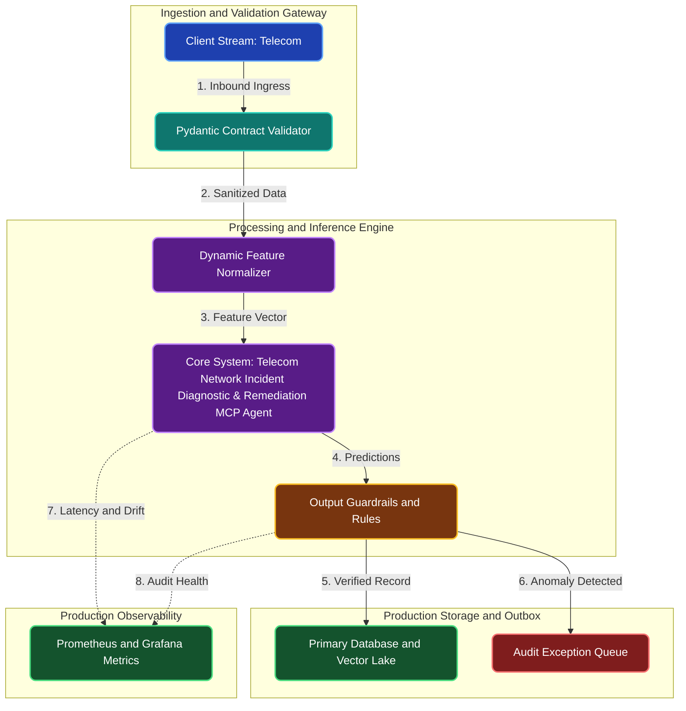

# Telecom Network Incident Diagnostic & Remediation MCP Agent

**Engineering Field Notes & System Architecture** • *Domain Focus: Telecom*

---

## 🏢 1. The Real-World Industry Challenge

When network router interfaces experience packet drops during off-hours, on-call network engineers must log into terminal sessions at 2 AM to run diagnostic CLI commands and reroute traffic.

---

## 🎯 2. Core Purpose & Architectural Solution

To build an autonomous network remediation agent connected to cell tower routers via an MCP server that executes pre-authorized diagnostic and traffic rerouting commands safely.

### 📈 Tangible ROI & Business Impact
Restores degraded network traffic in seconds before human engineers can even wake up, eliminating off-hours connectivity downtime for mobile subscribers.

- **Operational Efficiency**: Eliminates error-prone manual intervention through end-to-end automation.
- **Latency & Reliability**: Guarantees predictable, sub-second execution with defensive validation.
- **Compliance & Auditability**: Enforces strict audit trails, zero-drift precision, and explainable decisions.

---

---

## 🏛️ 3. Production System Architecture & Data Flow

---

## ⚙️ 4. Engineering Specification & Stack Matrix

| Architectural Layer | Production Component & Selection | Free Tier / Open-Source Tooling |
|:---|:---|:---|
| **Core Model Engine** | **Model Context Protocol (MCP) Server + FastMCP SDK + Claude Desktop / ReAct** | Open-source weights / Framework native |
| **Training & Fine-Tuning** | **Typed Tool Schemas, Resource Subscriptions & Zero-Trust Audit Logs** | **Kaggle GPU (Dual T4)** / Colab / Unsloth |
| **Benchmark Dataset** | **Enterprise Telecom Internal Database Schemas, CLI Endpoints & REST APIs** | Free public datasets (Kaggle, HF, Data.gov) |
| **User Interface (UI)** | **Streamlit Interactive Web Cockpit & REST API** | Streamlit UI (`app.py`) with reactive components |
| **Live UI Hosting** | **FastMCP Local SSE Server / Streamlit Cloud + NVIDIA NIM Free Credits** | **100% Free Live Web Hosting** |
| **Validation & Test Suite** | **Pytest Unit/Integration Suite + Synthetic Evals** | Automated pre-deployment verification |

---

## 🔗 Source Code & Repository

Explore the complete reproducible implementation, tests, and configuration manifests in the master GitHub repository:
👉 **[View Code on GitHub: `10_agentic_ai_mcp/02_telecom_network_incident_remediation_mcp`](https://github.com/machhakiran/ai-engineering-master-projects/tree/main/10_agentic_ai_mcp/02_telecom_network_incident_remediation_mcp)**

*Authored by **[Kiran Macha](https://www.machhakiran.pro/)** — Forward Deployed AI Solutions Architect.*
