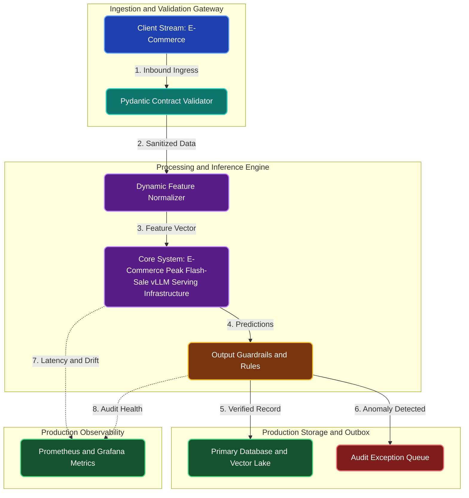

# E-Commerce Peak Flash-Sale vLLM Serving Infrastructure

**Engineering Field Notes & System Architecture** • *Domain Focus: E-Commerce*

---

## 🏢 1. The Real-World Industry Challenge

During annual flash sales, retail AI search and customer assistant endpoints experience sudden 10x traffic surges. Standard cloud setups crash under memory saturation, causing lost sales.

---

## 🎯 2. Core Purpose & Architectural Solution

To deploy a distributed vLLM serving infrastructure with continuous batching and automatic prefix caching that reuses common product catalog KV-caches across incoming shopper queries.

### 📈 Tangible ROI & Business Impact
Saves 65% of GPU memory and triples serving throughput, ensuring the retail site stays responsive without crashing during peak shopping moments.

- **Operational Efficiency**: Eliminates error-prone manual intervention through end-to-end automation.
- **Latency & Reliability**: Guarantees predictable, sub-second execution with defensive validation.
- **Compliance & Auditability**: Enforces strict audit trails, zero-drift precision, and explainable decisions.

---

---

## 🏛️ 3. Production System Architecture & Data Flow

---

## ⚙️ 4. Engineering Specification & Stack Matrix

| Architectural Layer | Production Component & Selection | Free Tier / Open-Source Tooling |
|:---|:---|:---|
| **Core Model Engine** | **Distributed vLLM Inference Engine & NVIDIA Triton Server with Continuous Batching** | Open-source weights / Framework native |
| **Training & Fine-Tuning** | **PagedAttention, Speculative Decoding & TensorRT FP16 / INT8 Quantization** | **Kaggle GPU (Dual T4)** / Colab / Unsloth |
| **Benchmark Dataset** | **High-Throughput Synthetic E-Commerce Concurrency Load Test Traces** | Free public datasets (Kaggle, HF, Data.gov) |
| **User Interface (UI)** | **Streamlit Interactive Web Cockpit & REST API** | Streamlit UI (`app.py`) with reactive components |
| **Live UI Hosting** | **Modal.com ($30/mo Free Credit) / Local Kubernetes (Kind) with NodePort** | **100% Free Live Web Hosting** |
| **Validation & Test Suite** | **Pytest Unit/Integration Suite + Synthetic Evals** | Automated pre-deployment verification |

---

## 🔗 Source Code & Repository

Explore the complete reproducible implementation, tests, and configuration manifests in the master GitHub repository:
👉 **[View Code on GitHub: `11_ai_infrastructure/03_ecommerce_black_friday_inference_scaler`](https://github.com/machhakiran/ai-engineering-master-projects/tree/main/11_ai_infrastructure/03_ecommerce_black_friday_inference_scaler)**

*Authored by **[Kiran Macha](https://www.machhakiran.pro/)** — Forward Deployed AI Solutions Architect.*
