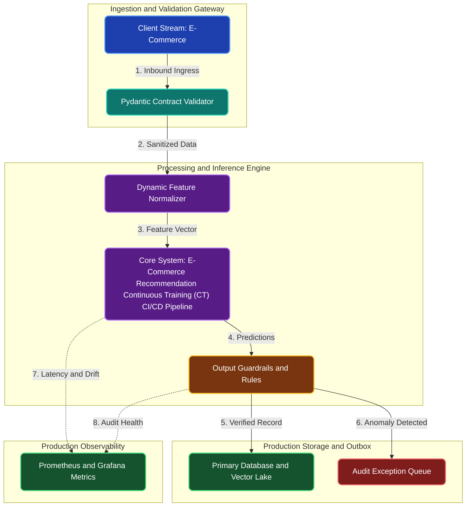

# E-Commerce Recommendation Continuous Training (CT) CI/CD Pipeline

**Engineering Field Notes & System Architecture** • *Domain Focus: E-Commerce*

---

## 🏢 1. The Real-World Industry Challenge

E-Commerce recommendation models become stale within days as new products are introduced and shopping trends shift. Manually retraining models weekly leads to missed revenue.

---

## 🎯 2. Core Purpose & Architectural Solution

To build an automated Continuous Training (CT) CI/CD pipeline using GitHub Actions and Docker that ingests daily purchase logs, evaluates offline recommendation accuracy, and updates serving endpoints.

### 📈 Tangible ROI & Business Impact
Ensures store recommendation algorithms always reflect trending items and seasonal shifts without requiring manual engineering maintenance.

- **Operational Efficiency**: Eliminates error-prone manual intervention through end-to-end automation.
- **Latency & Reliability**: Guarantees predictable, sub-second execution with defensive validation.
- **Compliance & Auditability**: Enforces strict audit trails, zero-drift precision, and explainable decisions.

---

---

## 🏛️ 3. Production System Architecture & Data Flow

---

## ⚙️ 4. Engineering Specification & Stack Matrix

| Architectural Layer | Production Component & Selection | Free Tier / Open-Source Tooling |
|:---|:---|:---|
| **Core Model Engine** | **End-to-End DVC Pipelines, MLflow Tracking, Ragas & DeepEval Evaluation Gates** | Open-source weights / Framework native |
| **Training & Fine-Tuning** | **Automated Continuous Training (CT) on GitHub Actions & Evidently Drift Checks** | **Kaggle GPU (Dual T4)** / Colab / Unsloth |
| **Benchmark Dataset** | **Production E-Commerce Feature Feeds, Ground Truth Labels & Synthetic Evals** | Free public datasets (Kaggle, HF, Data.gov) |
| **User Interface (UI)** | **Streamlit Interactive Web Cockpit & REST API** | Streamlit UI (`app.py`) with reactive components |
| **Live UI Hosting** | **DagsHub Free MLflow Server + GitHub Actions Pages & Streamlit Dashboard** | **100% Free Live Web Hosting** |
| **Validation & Test Suite** | **Pytest Unit/Integration Suite + Synthetic Evals** | Automated pre-deployment verification |

---

## 🔗 Source Code & Repository

Explore the complete reproducible implementation, tests, and configuration manifests in the master GitHub repository:
👉 **[View Code on GitHub: `12_mlops_llmops/03_ecommerce_recommendation_continuous_training`](https://github.com/machhakiran/ai-engineering-master-projects/tree/main/12_mlops_llmops/03_ecommerce_recommendation_continuous_training)**

*Authored by **[Kiran Macha](https://www.machhakiran.pro/)** — Forward Deployed AI Solutions Architect.*
