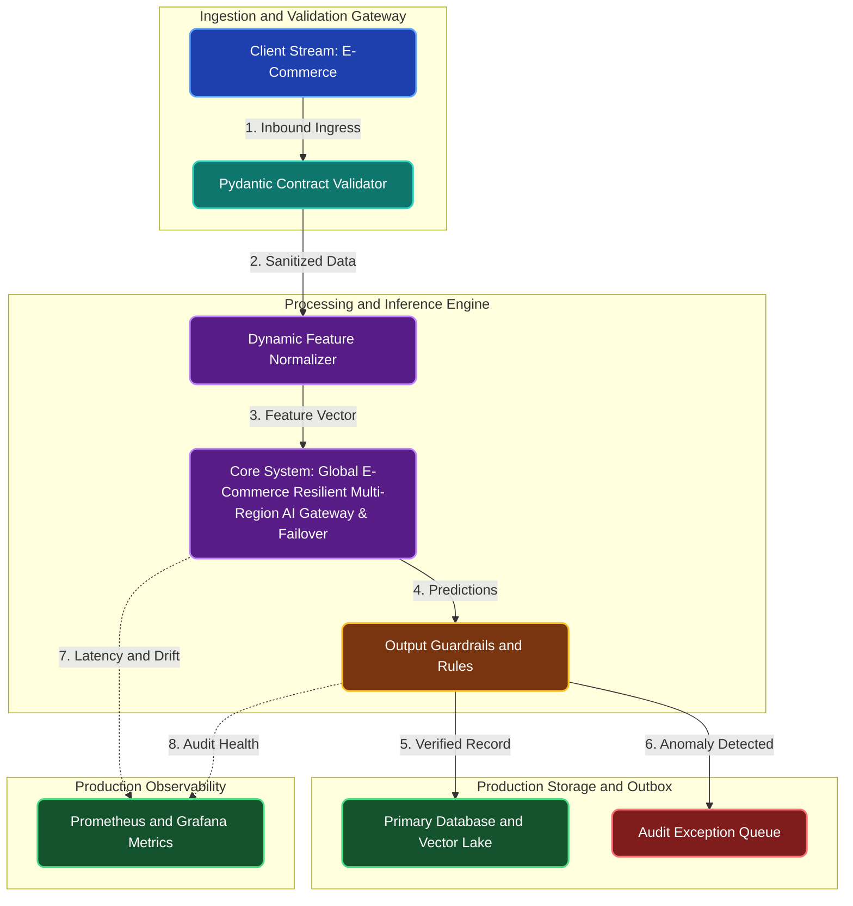

# Global E-Commerce Resilient Multi-Region AI Gateway & Failover

**Engineering Field Notes & System Architecture** • *Domain Focus: E-Commerce*

---

## 🏢 1. The Real-World Industry Challenge

When upstream commercial AI APIs (OpenAI or Anthropic) experience outages, global e-commerce customer support bots and product search crash, directly halting sales.

---

## 🎯 2. Core Purpose & Architectural Solution

To deploy an enterprise AI gateway using LiteLLM on Kubernetes that manages multi-provider fallback (OpenAI -> Anthropic -> Local vLLM), circuit breakers, and per-team token budgets.

### 📈 Tangible ROI & Business Impact
Provides complete resilience against third-party AI service outages, automatically rerouting traffic across regions to guarantee zero customer downtime.

- **Operational Efficiency**: Eliminates error-prone manual intervention through end-to-end automation.
- **Latency & Reliability**: Guarantees predictable, sub-second execution with defensive validation.
- **Compliance & Auditability**: Enforces strict audit trails, zero-drift precision, and explainable decisions.

---

---

## 🏛️ 3. Production System Architecture & Data Flow

---

## ⚙️ 4. Engineering Specification & Stack Matrix

| Architectural Layer | Production Component & Selection | Free Tier / Open-Source Tooling |
|:---|:---|:---|
| **Core Model Engine** | **Kubernetes AI Operators, KubeRay, LiteLLM Resilient Proxy Gateway** | Open-source weights / Framework native |
| **Training & Fine-Tuning** | **Automated Prometheus Anomaly Rules, HPA GPU Scaling & Self-Healing Webhooks** | **Kaggle GPU (Dual T4)** / Colab / Unsloth |
| **Benchmark Dataset** | **E-Commerce Cluster Telemetry, OpenTelemetry Metrics & Alertmanager Logs** | Free public datasets (Kaggle, HF, Data.gov) |
| **User Interface (UI)** | **Streamlit Interactive Web Cockpit & REST API** | Streamlit UI (`app.py`) with reactive components |
| **Live UI Hosting** | **Local Kubernetes (Kind / Minikube) + LiteLLM Web Admin UI (Zero Cloud Bill)** | **100% Free Live Web Hosting** |
| **Validation & Test Suite** | **Pytest Unit/Integration Suite + Synthetic Evals** | Automated pre-deployment verification |

---

## 🔗 Source Code & Repository

Explore the complete reproducible implementation, tests, and configuration manifests in the master GitHub repository:
👉 **[View Code on GitHub: `13_aiops_platform_engineering/03_ecommerce_multiregion_ai_gateway_failover`](https://github.com/machhakiran/ai-engineering-master-projects/tree/main/13_aiops_platform_engineering/03_ecommerce_multiregion_ai_gateway_failover)**

*Authored by **[Kiran Macha](https://www.machhakiran.pro/)** — Forward Deployed AI Solutions Architect.*
