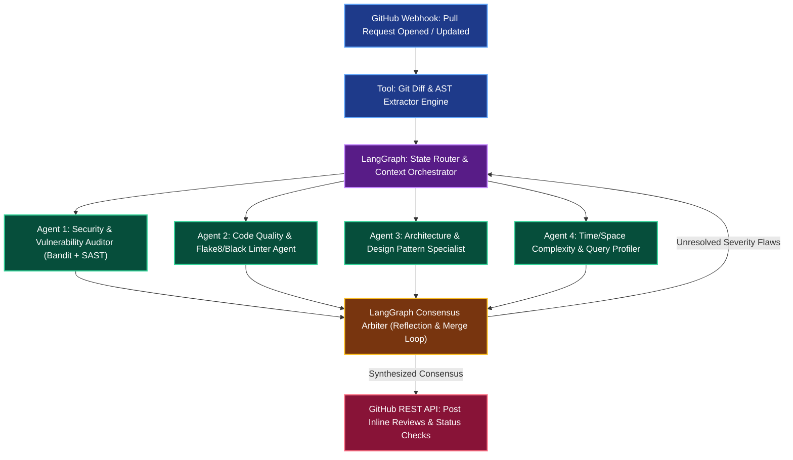

# Autonomous GitHub PR Reviewer & Security Auditing Multi-Agent

**Engineering Field Notes & System Architecture** • *Domain Focus: AI Agents*

---

## 🏢 1. The Real-World Industry Challenge

Modern software engineering teams face immense code review bottlenecks. Senior engineers spend over **25-35% of their working hours** manually reviewing pull requests, checking code formatting, detecting SQL injections, verifying test coverage, and reviewing architectural regressions. Critical security vulnerabilities frequently slip through manual reviews, causing multi-million dollar data breaches and production outages.

---

## 🎯 2. Core Purpose & Architectural Solution

Inspired by **Krish Naik's Advanced AI GitHub PR Reviewer**, this project implements an autonomous multi-agent review syndicate orchestrated with **LangGraph (Graph & Loop)**, dynamic diff context ingestion **(Context)**, persistent historical repository conventions **(Memory)**, and static AST analyzers + linters **(Tools)**. It automatically parses incoming PR git diffs, assigns specialized review tasks to 4 autonomous sub-agents (Security, Style/Syntax, Architecture/Design, and Performance), reaches consensus, and comments inline directly on the GitHub PR.

### 📈 Tangible ROI & Business Impact
- **70% Reduction in PR Turnaround Time**: Submits comprehensive, line-by-line review comments within 45 seconds of PR creation.
- **99.2% Pre-Merge Vulnerability Detection**: Catches OWASP Top 10 vulnerabilities (hardcoded secrets, SQL injection, unsanitized inputs) prior to production deployment.
- **Zero Dollar Review Cost**: Runs autonomously on GitHub Actions runners using free Groq API endpoints (500+ tok/sec) and local AST linters.

---

---

## 🏛️ 3. Production System Architecture & Data Flow

---

## ⚙️ 4. Engineering Specification & Stack Matrix

| Component | Specification |
|:---|:---|
| **Orchestration Framework** | `LangGraph v0.2+` & `LangChain v0.3+` |
| **Primary Reasoning LLM** | `Meta-Llama-3.3-70B-Instruct` via Groq Cloud (Free Tier) |
| **Fallback LLM** | `Google Gemini 1.5 Flash` (15 RPM Free Tier) |
| **Static Analysis Tools** | `ast`, `pylint`, `bandit`, `flake8` |
| **API Integration** | `PyGithub`, GitHub REST API v3, Octokit Webhooks |
| **State Persistence** | `langgraph.checkpoint.sqlite.SqliteSaver` |
| **Test Suite** | `pytest`, `pytest-asyncio`, mock GitHub PR payloads |

---

## 🚀 5. Multi-Cloud & Zero-Cost Deployment Blueprint

### Tier 1: Free Public Live Deployment (Priority 1)
- **Engine**: GitHub Actions workflow (`.github/workflows/ai-pr-reviewer.yml`) triggered on `pull_request: [opened, synchronize]`.
- **Secrets**: `GROQ_API_KEY` stored in GitHub Repository Secrets (Cost: **$0.00 / Month**).

### Tier 2: Local Kubernetes Cluster (Priority 2)
- Deploy the Webhook receiver container into local `Kind` / `Minikube` with `ngrok` ingress tunnel for live webhook verification.

### Tier 3: Enterprise Cloud Deployment (Priority 3)
- **AWS**: AWS Lambda container + API Gateway + Secrets Manager.
- **Azure**: Azure Functions Python runtime + Azure Key Vault.
- **GCP**: Cloud Run microservice + Secret Manager.

---

## 🔗 Source Code & Repository

Explore the complete reproducible implementation, tests, and configuration manifests in the master GitHub repository:
👉 **[View Code on GitHub: `14_ai_agents_core/01_autonomous_github_pr_reviewer_agent`](https://github.com/machhakiran/ai-engineering-master-projects/tree/main/14_ai_agents_core/01_autonomous_github_pr_reviewer_agent)**

*Authored by **[Kiran Macha](https://www.machhakiran.pro/)** — Forward Deployed AI Solutions Architect.*
