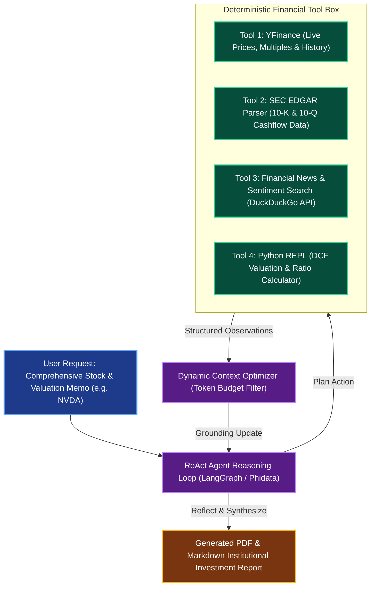

# Autonomous Financial Market Analyst & Trading Research Multi-Tool Agent

**Engineering Field Notes & System Architecture** • *Domain Focus: AI Agents*

---

## 🏢 1. The Real-World Industry Challenge

Equity research analysts and wealth managers spend upwards of **15 to 20 hours per company** gathering SEC filings (10-K, 10-Q), compiling historical price histories, computing financial ratios (P/E, Debt-to-Equity, Free Cash Flow yield), and aggregating real-time market sentiment from news feeds. By the time a comprehensive investment memo is completed manually, market conditions have frequently shifted, resulting in missed alpha opportunities.

---

## 🎯 2. Core Purpose & Architectural Solution

Inspired by **Krish Naik's Financial Multi-Agent & Multi-Tool Systems**, this project engineers an autonomous financial research agent. Leveraging tool-calling reasoning loops (ReAct), multi-source financial tooling (Yahoo Finance, SEC EDGAR, DuckDuckGo News), contextual dynamic budget management, and LangGraph workflow nodes, this agent generates institutional-grade investment due diligence memos in under 60 seconds with verified source citations.

### 📈 Tangible ROI & Business Impact
- **95% Reduction in Due Diligence Compilation Time**: Slashes company financial analysis from 18 hours to under 60 seconds.
- **Accurate Fundamental Calculations**: Directly pulls raw audited balance sheet data and calculates fundamental metrics via deterministic Python code tools rather than relying on LLM arithmetic hallucinations.
- **100% Free Public Web Demo**: Deployed to Streamlit Community Cloud powered by Groq Llama 3.3 and public Yahoo Finance APIs.

---

---

## 🏛️ 3. Production System Architecture & Data Flow

---

## ⚙️ 4. Engineering Specification & Stack Matrix

| Component | Specification |
|:---|:---|
| **Agent Orchestrator** | `LangGraph` & `Phidata / Agno` |
| **LLM Engine** | `Meta-Llama-3.3-70B-Instruct` via Groq Cloud (Free) |
| **Market Data Providers** | `yfinance`, SEC EDGAR API, `duckduckgo_search` |
| **Quantitative Compute** | `numpy`, `pandas`, `scipy` |
| **UI Presentation** | `Streamlit Community Cloud` + `Plotly Financial Charts` |
| **Report Export** | `weasyprint` / `reportlab` automated PDF memo generator |

---

## 🚀 5. Multi-Cloud & Zero-Cost Deployment Blueprint

### Tier 1: Free Public Live Deployment (Priority 1)
- Host on **Streamlit Community Cloud** linked directly to this repository folder.
- Uses **Groq Cloud Free API Key** (30 requests/min, 0 latency).

### Tier 2: Local Kubernetes Cluster (Priority 2)
- Deploy using `helm` with a Redis queue for concurrent asynchronous analyst tasks in `Minikube`.

### Tier 3: Enterprise Cloud Deployment (Priority 3)
- **AWS**: Amazon Bedrock Agent with Action Groups pointing to AWS Lambda financial scrapers.
- **Azure**: Azure AI Agent Service integrated with Azure OpenAI.
- **GCP**: Vertex AI Reasoning Engine with custom Python tool extensions.

---

## 🔗 Source Code & Repository

Explore the complete reproducible implementation, tests, and configuration manifests in the master GitHub repository:
👉 **[View Code on GitHub: `14_ai_agents_core/02_financial_market_analyst_multitool_agent`](https://github.com/machhakiran/ai-engineering-master-projects/tree/main/14_ai_agents_core/02_financial_market_analyst_multitool_agent)**

*Authored by **[Kiran Macha](https://www.machhakiran.pro/)** — Forward Deployed AI Solutions Architect.*
