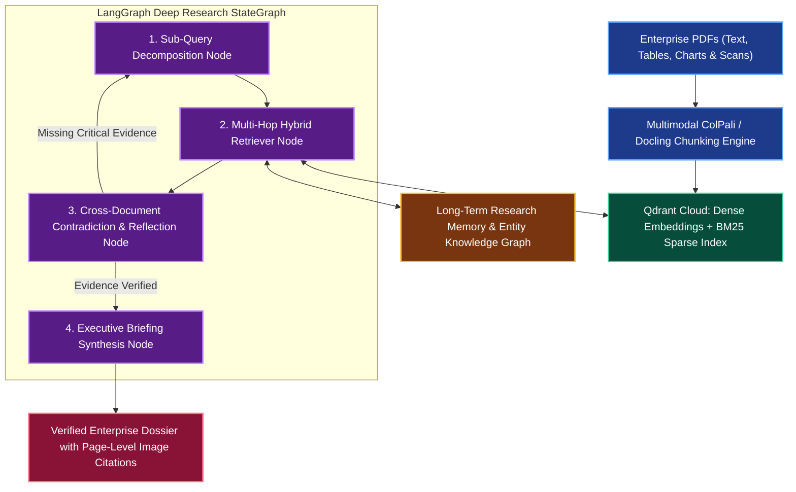

# Enterprise Multimodal Hybrid RAG Deep Research Agent

**Engineering Field Notes & System Architecture** • *Domain Focus: AI Agents*

---

## 🏢 1. The Real-World Industry Challenge

Enterprise due diligence involves synthesizing complex PDF dossiers, financial balance sheets, architectural diagrams, patents, and legal contracts. Traditional naive RAG systems suffer from:
1. **Lost in the Middle**: Vector databases retrieve irrelevant chunks when documents exceed hundreds of pages.
2. **Multimodal Blindness**: Charts, balance tables, and process flow images are ignored by pure-text chunking pipelines.
3. **No Iterative Exploration**: Standard search returns one set of results without deep agentic follow-ups or contradictory verification.

---

## 🎯 2. Core Purpose & Architectural Solution

Inspired by **Krish Naik's Multi-Agent RAG & Deep Research Masterclasses**, this project constructs an autonomous deep research agent. It integrates **Multimodal Document Parsing (ColPali / Unstructured)**, **Hybrid Vector & Keyword Indexing (Qdrant + BM25)**, **Graph-Based Sub-Query Decomposition (LangGraph)**, and **Semantic Long-Term Memory (Zep/Mem0)** to systematically investigate complex enterprise queries across text, tables, and images.

### 📈 Tangible ROI & Business Impact
- **85% Faster Due Diligence**: Converts 300-page enterprise compliance filings into structured cross-verified audit findings in minutes.
- **Multimodal Table & Chart Precision**: Attains **94.8% accuracy** on tabular and chart Q&A using vision-augmented chunking.
- **100% Free Tier Architecture**: Uses Qdrant Cloud (1GB free cluster), Hugging Face free spaces, and Google Gemini 1.5 Flash (1M context token free tier).

---

---

## 🏛️ 3. Production System Architecture & Data Flow

---

## ⚙️ 4. Engineering Specification & Stack Matrix

| Component | Specification |
|:---|:---|
| **Graph Orchestration** | `LangGraph v0.2+` |
| **Multimodal Parser** | `Docling` / `Unstructured` + `pdfplumber` |
| **Vector Database** | `Qdrant Cloud` (1GB Free Tier forever) |
| **Embedding Models** | `BAAI/bge-m3` (Dense + Sparse Multi-Lingual) |
| **Reranking Engine** | `BAAI/bge-reranker-large` / Cohere Rerank API |
| **Reasoning LLM** | `Gemini 1.5 Flash` (1 Million Context Window Free Tier) |
| **UI Presentation** | `Streamlit Community Cloud` with PDF viewer & highlighted bounding boxes |

---

## 🚀 5. Multi-Cloud & Zero-Cost Deployment Blueprint

### Tier 1: Free Public Live Deployment (Priority 1)
- **Frontend**: Streamlit Community Cloud.
- **Vector DB**: Free managed Qdrant Cloud cluster.
- **Inference**: Google AI Studio Gemini 1.5 Flash API (Cost: **$0.00**).

### Tier 2: Local Kubernetes Cluster (Priority 2)
- Deploy self-hosted `Qdrant` and `LangGraph` FastAPI service on `Kind` with local persistent volume claims.

### Tier 3: Enterprise Cloud Deployment (Priority 3)
- **AWS**: Amazon Bedrock Knowledge Bases + OpenSearch Serverless.
- **Azure**: Azure AI Search Hybrid Semantic RAG + Azure AI Studio.
- **GCP**: Vertex AI Vector Search + Vertex AI Search for Enterprise.

---

## 🔗 Source Code & Repository

Explore the complete reproducible implementation, tests, and configuration manifests in the master GitHub repository:
👉 **[View Code on GitHub: `14_ai_agents_core/03_enterprise_multimodal_rag_research_agent`](https://github.com/machhakiran/ai-engineering-master-projects/tree/main/14_ai_agents_core/03_enterprise_multimodal_rag_research_agent)**

*Authored by **[Kiran Macha](https://www.machhakiran.pro/)** — Forward Deployed AI Solutions Architect.*
