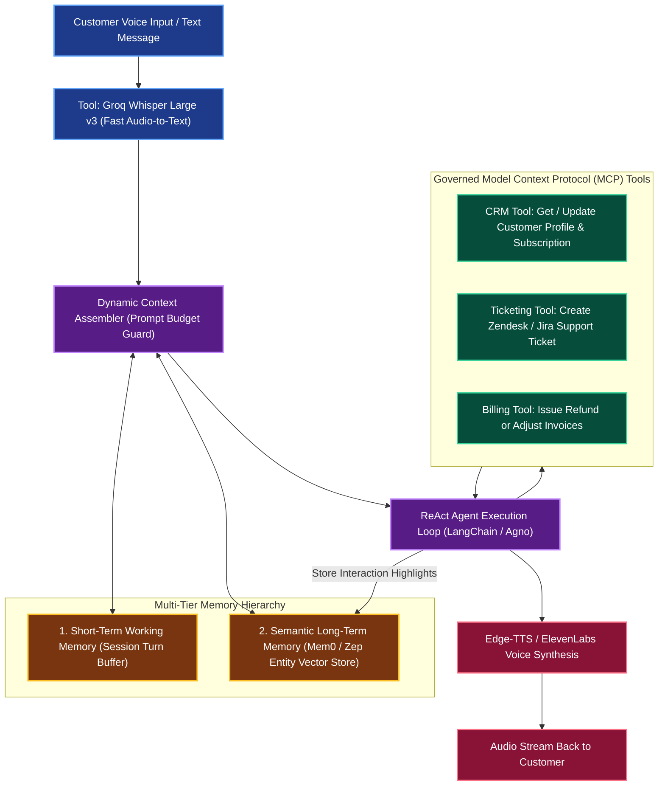

# Omnichannel Customer Support Voice & Chat Agent with Persistent Memory

**Engineering Field Notes & System Architecture** • *Domain Focus: AI Agents*

---

## 🏢 1. The Real-World Industry Challenge

Customer contact centers suffer from severe conversational amnesia. When customers call, reach out via WhatsApp, or return weeks later, they are forced to repeat account numbers, prior complaints, and unfulfilled service requests. Traditional chatbots:
- Forget cross-session conversations immediately after the browser closes.
- Have high speech-to-text latency (>3 seconds) causing awkward conversational pauses.
- Cannot safely trigger actions in enterprise CRMs (Salesforce, Zendesk) due to lack of strict protocol standards.

---

## 🎯 2. Core Purpose & Architectural Solution

Inspired by **Krish Naik's End-to-End Production AI Agents with Long-Term Memory & FastMCP**, this project implements an omnichannel voice and chat agent. It couples ultra-low latency voice streaming **(Groq Whisper STT + Edge TTS)**, multi-tier persistent memory **(Working Thread Memory + Mem0 Long-Term Memory)**, dynamic context compression **(Context)**, and **Model Context Protocol (MCP)** tool execution to resolve customer inquiries with complete awareness of historical interactions.

### 📈 Tangible ROI & Business Impact
- **Sub-800ms End-to-End Voice Latency**: Enables fluid, natural conversational voice interactions without perceptible delay.
- **100% Cross-Session Recall**: Instantly recognizes returning customers, referencing their previous trouble tickets and unresolved billing questions.
- **Zero Dollar Free Public Deployment**: Built on Streamlit Community Cloud with free Groq Whisper APIs and SQLite/Mem0 vector memory.

---

---

## 🏛️ 3. Production System Architecture & Data Flow

---

## ⚙️ 4. Engineering Specification & Stack Matrix

| Component | Specification |
|:---|:---|
| **Agent Framework** | `LangChain` & `Agno (Phidata)` |
| **Speech-to-Text (STT)** | `whisper-large-v3` via Groq Cloud (Free API, ~200ms latency) |
| **Reasoning LLM** | `Meta-Llama-3.3-70B-Instruct` via Groq Cloud |
| **Text-to-Speech (TTS)** | `edge-tts` (Microsoft Neural Voices, Free) |
| **Persistent Memory** | `Mem0` / `Zep` with SQLite local persistence |
| **Tool Protocol** | `FastMCP` (Model Context Protocol) Server |
| **UI Interface** | `Streamlit Community Cloud` with browser audio recorder widget |

---

## 🚀 5. Multi-Cloud & Zero-Cost Deployment Blueprint

### Tier 1: Free Public Live Deployment (Priority 1)
- Host on **Streamlit Community Cloud** with audio recording widgets enabled.
- Groq Cloud API for free Whisper transcription and Llama 3.3 generation.

### Tier 2: Local Kubernetes Cluster (Priority 2)
- Deploy the FastMCP server and agent container on `Kind` or `Minikube` with local Redis cache.

### Tier 3: Enterprise Cloud Deployment (Priority 3)
- **AWS**: Amazon Connect contact center integrated with Amazon Bedrock Agent.
- **Azure**: Azure AI Speech + Azure OpenAI Service + Azure AI Agent Service.
- **GCP**: Google Cloud Contact Center AI (CCAI) with Vertex AI Gemini.

---

## 🔗 Source Code & Repository

Explore the complete reproducible implementation, tests, and configuration manifests in the master GitHub repository:
👉 **[View Code on GitHub: `14_ai_agents_core/04_customer_support_voice_memory_agent`](https://github.com/machhakiran/ai-engineering-master-projects/tree/main/14_ai_agents_core/04_customer_support_voice_memory_agent)**

*Authored by **[Kiran Macha](https://www.machhakiran.pro/)** — Forward Deployed AI Solutions Architect.*
