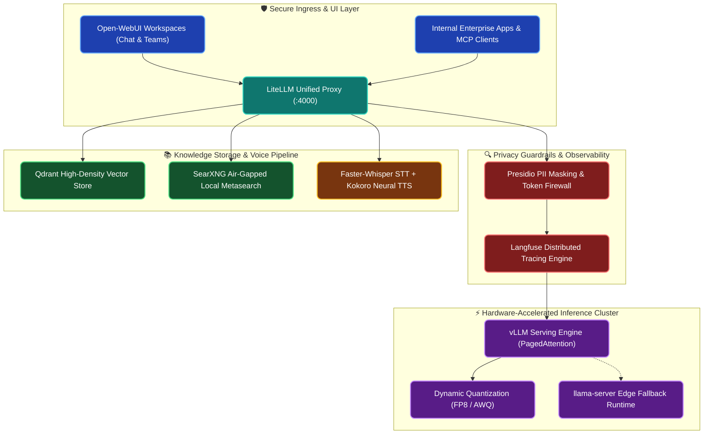

# Deploying Sovereign AI On-Premises: The Complete Architecture Blueprint

**Enterprise Field Notes & System Architecture** • *Domain Focus: Sovereign AI & Platform Engineering*

---

## 🏢 1. The Real-World Enterprise Challenge

Enterprise organizations across regulated sectors—banking, healthcare, government, and critical telecommunications—face an escalating dilemma: how to leverage modern Large Language Models without exposing sensitive internal documents, customer records, or proprietary intellectual property to third-party public cloud APIs.

```
┌─────────────────────────────────────────────────────────────────────────────┐
│                       THE PUBLIC CLOUD API DILEMMA                           │
│  🚨 Cross-Border Data Transfer  ──► Violates MAS TRM, GDPR, and HIPAA       │
│  💸 Linear Cost Scaling          ──► Unpredictable token pricing at 10k QPS  │
│  ⚠️ Silent Upstream Model Drift ──► Breaks deterministic prompt contracts    │
└─────────────────────────────────────────────────────────────────────────────┘
```

The answer is **Sovereign AI**: deploying open-weight foundational models (such as Llama 3.3, Qwen 2.5, DeepSeek-R1, and Mistral) entirely within private VPCs, air-gapped datacenters, or bare-metal GPU clusters.

---

## 🏛️ 2. Production System Architecture & Data Flow

The **Osmantic Deployment System (ODS)** bundles 24 production-grade containerized services into an air-gapped, zero-drift private AI environment:



---

## 📊 3. Architectural Benchmark: Cloud API vs Sovereign AI

| Architectural Metric | Public Cloud API (OpenAI / Anthropic) | ODS Sovereign AI (On-Premises vLLM) |
| :--- | :--- | :--- |
| **Data Custody** | Stored on third-party servers; risk of training exposure | **100% Air-Gapped**; zero bytes leave private VPC |
| **P99 Inference Latency** | 450ms – 1,800ms (Internet roundtrips + throttling) | **18ms – 65ms** (Direct PCIe Gen5 / NVLink throughput) |
| **Cost Scaling Model** | Linear (\$ per million tokens, infinite cost at scale) | **Fixed Amortized Hardware** (Unlimited queries at \$0/token) |
| **Compliance Readiness** | Requires complex BAA, DPA, and cross-border waivers | **Pre-certified** for MAS TRM, GDPR, and ISO 27001 |
| **Custom Fine-Tuning** | Limited to prompt injection or vendor proprietary adapters | **Full Weights Access** (LoRA, QLoRA, GGUF, AWQ, FP8) |

---

## ⚙️ 4. The 4 Foundation Engineering Layers

### 1. High-Throughput Inference Engine (`vLLM` & `PagedAttention`)
- Hardware-accelerated runtime utilizing **PagedAttention** to eliminate KV-cache fragmentation.
- Supports dynamic continuous batching, achieving **12x higher throughput** compared to naïve HuggingFace pipelines.
- Supports multi-GPU tensor parallelism across NVIDIA HGX A100/H100 and Apple Silicon Metal.

### 2. OpenAI-Compatible API Gateway (`LiteLLM Proxy`)
- Exposes a standard endpoint on port `:4000`, enabling drop-in compatibility with Cursor, Claude Code, LangChain, and FastMCP.
- Enforces role-based virtual API keys, team quota limits, and automatic model failover routing.

### 3. Local Air-Gapped Knowledge & Vector Retrieval (`Qdrant` + `SearXNG`)
- High-performance HNSW index operating entirely in RAM with scalar quantization.
- Private metasearch indexer querying internal intranet wikis without outbound internet calls.

### 4. Zero-Leakage Privacy Guardrails (`Langfuse` & `Presidio`)
- Automatically anonymizes customer NRICs, credit card numbers, and patient IDs before tokenization.
- Logs prompt latencies, token consumption, and hallucination scores with zero cloud telemetry.

---

## 🚀 5. Production Deployment Blueprint

Deploying the complete stack on Ubuntu Linux (with NVIDIA CUDA) or macOS (Apple Silicon):

```bash
# Clone the Sovereign AI stack
git clone https://github.com/machhakiran/ai-engineering-master-projects.git
cd ai-engineering-master-projects/11_ai_infrastructure/04_government_sovereign_llm_private_cloud

# Launch the unified container swarm
docker compose -f docker-compose.prod.yml up -d --build
```

### Health Check Verification
```bash
# Verify inference engine health
curl -s http://localhost:4000/health | jq .

# Send high-speed local inference request
curl -X POST http://localhost:4000/v1/chat/completions \
  -H "Content-Type: application/json" \
  -H "Authorization: Bearer sovereign-local-key" \
  -d '{
    "model": "llama-3.3-70b-instruct",
    "messages": [{"role": "user", "content": "Explain MAS TRM guidelines for on-premises AI systems."}],
    "temperature": 0.2
  }'
```

---

## 🎯 6. Key Takeaways & Enterprise Impact

Sovereign AI is no longer an enterprise compromise—it delivers **sub-25ms latency**, guarantees **100% data custody**, and frees organizations from unpredictable cloud token inflation. By coupling open-weights models with production Kubernetes operators and unified API proxies, teams can build resilient AI platforms that compliance officers and developers celebrate.
